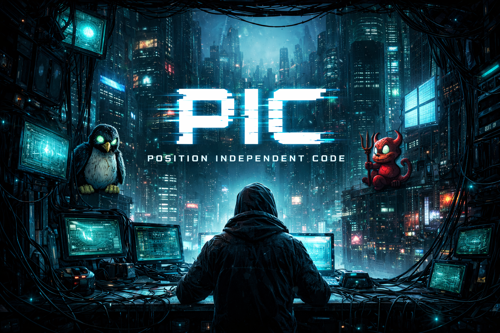

# picblobs

<p align="center">
  
</p>

Pre-compiled, position-independent code (PIC) blobs for loading and executing
arbitrary payloads on multiple operating systems and architectures. Eliminates
the need for hand-writing shellcode by providing tested, cross-platform PIC
stubs through a simple Python API.

## User Story

```text
As a cybersecurity developer, I am sick and tired of writing assembly and shellcode.
It would be amazing if Opus just solved the problem for me and yeeted it into pypi.
```

## Platform support

### Architectures

| Architecture | Endianness | Bits | Traits |
|---|---|---|---|
| x86_64 | little | 64 | |
| i686 | little | 32 | uses_mmap2 |
| aarch64 | little | 64 | openat_only |
| armv5 (ARM mode) | little | 32 | uses_mmap2 |
| armv5 (Thumb mode) | little | 32 | uses_mmap2 |
| armv7 (Thumb-2) | little | 32 | uses_mmap2 |
| s390x (z13) | big | 64 | uses_old_mmap |
| mipsel32 | little | 32 | uses_mmap2, needs_got_reloc |
| mipsbe32 | big | 32 | uses_mmap2, needs_got_reloc |

### Operating systems

| OS | Architectures | Blob types | Runner |
|---|---|---|---|
| Linux | x86_64, i686, aarch64, armv5_arm, armv5_thumb, armv7_thumb, s390x, mipsel32, mipsbe32 | hello, nacl_hello, nacl_client, nacl_server, stager_tcp, test_tcp_ok, test_pass, ul_exec | Direct execution via QEMU user-static |
| FreeBSD | x86_64, i686, aarch64, armv5_arm, armv5_thumb, armv7_thumb, mipsel32, mipsbe32 | hello, nacl_hello, nacl_client, nacl_server, stager_tcp, test_tcp_ok, test_pass, ul_exec | Translating loader: patches FreeBSD syscall numbers to Linux equivalents at load time |
| Windows | x86_64, i686, aarch64 | hello_windows, alloc_jump | Mock TEB/PEB on Linux |

### Current blob inventory

| Blob | OS | Description |
|---|---|---|
| `hello` | Linux, FreeBSD | Write "Hello, world!" via raw syscalls and exit |
| `hello_windows` | Windows | Write "Hello, world!" via PEB walk + DJB2 hash resolution of kernel32.dll exports (GetStdHandle, WriteFile, ExitProcess) |
| `nacl_hello` | Linux, FreeBSD | TweetNaCl self-test: encrypt/decrypt round-trip with crypto_secretbox (XSalsa20-Poly1305) and exit |
| `nacl_server` | Linux, FreeBSD | NaCl encrypted TCP server: bind, accept, decrypt message with crypto_secretbox, send encrypted ACK |
| `nacl_client` | Linux, FreeBSD | NaCl encrypted TCP client: connect, encrypt and send message, decrypt ACK from server |

## Quick start

```bash
source sourceme
./buildall
picblobs verify
```

## Documentation

Full documentation is available as an [mdbook](https://rust-lang.github.io/mdBook/) in the [`docs/`](docs/) directory:

```bash
# Serve locally
mdbook serve docs/

# Or build static HTML
mdbook build docs/
```

### User Guide

- [Getting Started](docs/src/getting-started.md) -- prerequisites, setup, Docker
- [Building](docs/src/building.md) -- Bazel build system, platform configs, staging
- [Running Blobs](docs/src/running.md) -- CLI usage
- [picblobs-cli](docs/src/picblobs-cli.md) -- click CLI companion package (build / run / verify)
- [Testing](docs/src/testing.md) -- test suite, filtered runs, test architecture

### Development

- [Writing a Blob](docs/src/writing-blobs.md) -- Linux and Windows blob examples
- [Code Generation](docs/src/code-generation.md) -- registry and generated files
- [Adding an Architecture](docs/src/adding-architecture.md) -- step-by-step guide
- [Adding a Syscall](docs/src/adding-syscall.md) -- step-by-step guide
- [Formatting and Linting](docs/src/formatting.md) -- clang-format, ruff

### Reference

- [Platform Support](docs/src/platform-support.md) -- architectures, traits, OS details
- [Test Runners](docs/src/test-runners.md) -- Linux, Windows, FreeBSD runner internals
- [Project Structure](docs/src/project-structure.md) -- full directory layout
- [Kernel Toolkit](docs/src/kernel-toolkit.md) -- kernel-mode tools, encrypted shell, VM tests
- [Specification](docs/src/specification.md) -- requirements, ADRs, verification specs
